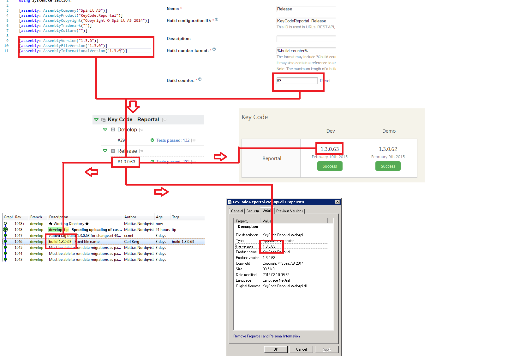

# Spinit.Build.Versioning

## What it does
Spinit.Build.Versioning helps you keeping your versioning consistent through 

- assembly files 
- executables
- teamcity builds
- octopus deployment packages and releases
- with a little extra effort, your hg repository

Spinit.Build.Versioning thinks you should adopt semver (`major.minor.patch`), but also thinks that an extra `build` number part looks nice. While you take care of the increments of major, minor and patch numbers in your AssemblyInfo-file, Spinit.Build.Versioning, together with TeamCity and Octopus takes care of the rest, namely:

- Extracts the AssemblyVersion from your AssemblyInfo-file, and appends the teamcity build number to the end of it, which gives you a version number like `2.0.3.176` and relabels the TeamCity build with this new version number. (Which otherwise would be `176`). 
- The outputted assembly or executable of the TeamCity build, will be versioned `2.0.3.176`, instead of only `2.0.3`.
- If you are using octopus, the nuget package created by octopus will now be named `Your.Package.2.0.3.176.nupkg` instead of `Your.Package.2.0.3.nupkg`, which also means that any release from this package will get the `2.0.3.176` version number.
-  You can also let TeamCity Tag your commit in Mercurial with the Tag `build-2.0.3.176`

## Instructions
- Install Spinit.Build.Versioning in any top-level project in your solution by using the following command in the [Package Manager Console](http://docs.nuget.org/docs/start-here/using-the-package-manager-console)

        
<code>PM&gt; Install-Package Spinit.Build.Versioning</code>

- Make sure your AssemblyVersion-attribute contains a three-part (`major.minor.patch`) versioning number.

### TeamCity
- Make sure your Build number format is set to `%build.counter%`. You find it under `General Settings`. Spinit.Build.Versioning is not tested with any other format but you are welcome to try.

- In your build step where you compile, add the following command line parameter. `/p:ExtendTeamCityVersioning=true`

- In the same build step, it is also possible to configure where the AssemblyVersion attribute can be found. The default is `Properties\AssemblyInfo.cs` but often you might wanna override this with a linked common assembly info file. You can do this by adding a Command Line Parameter like this `/p:AssemblyInfoFile=../ProductAssemblyInfo.cs`.

- To tag any commit related to a successful build with the version number, add the Build Feature called VCS-labeling to your build configuration, with the labeling pattern `build-%system.build.number%`. You probably only want to label successful builds.

### If you are using Octopus Deploy
- In teamcity, you do not have to use the ExtendTeamCityVersioning parameter. When the "Run OctoPack"-checkbox is checked, this is already handled.

- In Octopus you should make sure that in your Project Settings, the radiobutton `Use the version number from an included NuGet package` is chosen.
